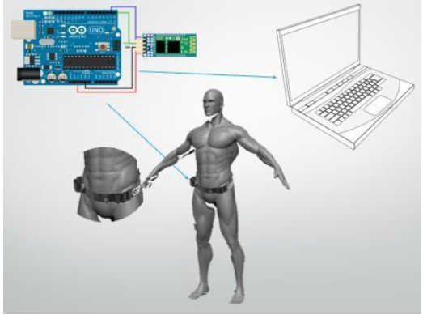
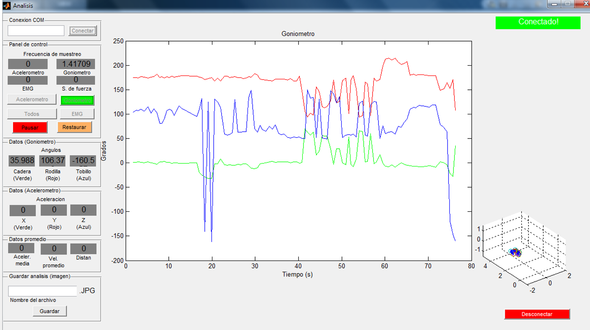
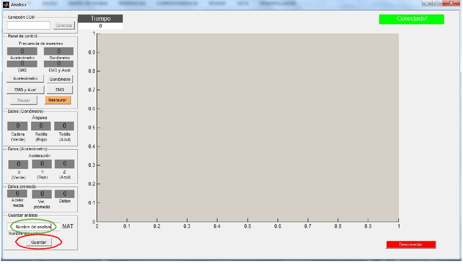
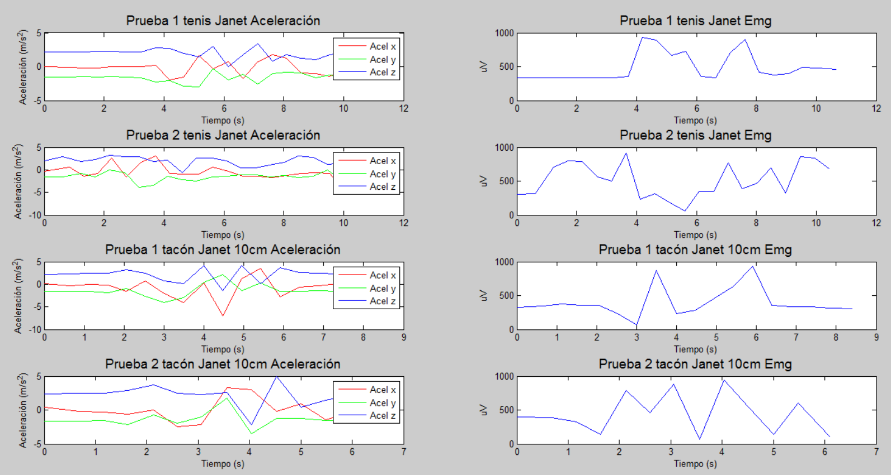

# -Wireless-EMG-accelerometer-and-Kinect-for-motion-analysis
Motion analysis study by using a wireless EMG, accelerometer and kinect tracking.

The name of this project:
"Gait analysis and the relationship of the quadriceps’ muscle activity in the sagittal
plane, under distinct conditions of footwear"

The quadriceps’ muscle is one of the most powerful muscles in the human body, 
and it is one of the muscles which exerts more power in the common human movement.

Therefore, I wanted to test and verify the footwear influence in quadriceps’ muscle activity,
to corroborate that indeed the more high the footwear platform, the more stress (electrical
activity) in the quadriceps’ muscle is perceived.

STRUCTURE: 

FOLDER EMG & accelerometer results****** Data adquisition of EMG & accelerometer results.

FOLDER Goniometer results*************** Data adquisition of Goniometer results.

ANALISIS.M ***************************** The main code.

ANALISIS.FIG *************************** Graphical User interface from Matlab.

USER'S MANUAL ************************** GUI manual.

ARTICLE********************************* Article created at the end of the project.

DEMO************************************ Quick video demonstration.

The materials:
-Kinect----------> to track the human bodu joints, such as, hips, knees, heels, elbows, shoulders.
                   to compare the angles formed under distinct conditions of footwear.
-Accelerometers--> to track the hip's position everytime, as well as the acceleration, velocity 
                   and final distance.                   
-EMG-------------> Electromiogrpah, the electronic device which adquires the muscle's electrical 
                   activity. Which it was biuld and design from scratch. Morever, the signal adquired 
                   was filtered with a Fast Fourier Transform and then a bluetooth device was set.
 
 Quick overview diagram.
 
 The Program running the goniometer 
 
 Graphical User Interface
 
 Some results:

 
 
                   
